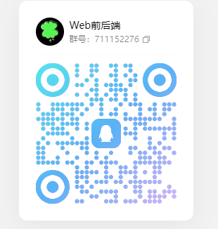

# 文档待完善

### 说明
本项目拉取了 unibest 项目，其中，修改的很多的内容，包括路由拦截，请求拦截等内容，后续使用说明会完善在文档当中，不保证目前版本没有BUG和当前版本的稳定性，如果有问题请及时反馈，谢谢！

### 配置

其中框架的大部分配置都可以参考于 unibest项目进行配置

### 致谢

感谢 UniBest 项目的作者提供的框架

感谢 wot ui 项目的作者提供的组件库

.....

其中也可能使用了别的作者的项目，致谢开源精神！

### 项目地址

配套后端：https://gitee.com/xiaodu6/lucky-admin-vue

unibest: https://gitee.com/feige996/unibest

unibest文档：https://www.unibest.tech/

Wot Ui 文档：https://wot-design-uni.cn/

### BUG反馈项目交流

